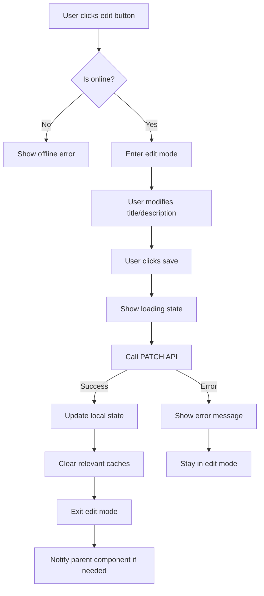

# Implementation Plan: Editable Time Entry Title and Description

## Overview

This plan outlines the implementation of editable title and description for time entries, both for the active timer on the timer page and for time entries in the TimeEntryDetailModal on the entries page.

## API Reference

Based on `api_documentation.md`, the backend provides:

**Endpoint:** `PATCH /api/time_entries/{id}/`

**Request Body:**
```json
{
    "title": "Updated Task Title",
    "description": "Updated description text",
    "tags": [1, 2]
}
```

**Response:** Returns the updated TimeEntry object

**Validation Rules:**
- At least one field must be provided
- Users can only update their own time entries
- Works for both active and inactive time entries

---

## Implementation Steps

### Step 1: Add PATCH API Method to `src/lib/api.ts`

Add an `update` method to the `timeEntries` object:

```typescript
update: async (id: number, data: {
    title?: string;
    description?: string | null;
    tags?: number[];
}) => {
    // Clear related caches when updating
    apiCache.delete('time_entries:all');
    apiCache.delete('time_entries:current_active');
    try {
        localStorage.removeItem(LOCALSTORAGE_PREFIX + 'time_entries:all');
        localStorage.removeItem(LOCALSTORAGE_PREFIX + 'time_entries:current_active');
    } catch (err) {}
    
    const result = await api.patch(`api/time_entries/${id}/`, { json: data }).json<TimeEntry>();
    return result;
}
```

### Step 2: Update Timer Page (`src/routes/timer/+page.svelte`)

**Current State:**
- Active entry title is displayed at line 787: `<h2 class="text-xl font-bold text-base-content">{activeEntry.title}</h2>`
- No edit functionality exists

**Changes Required:**

1. Add state variables for editing:
   ```typescript
   let isEditingTitle = $state(false);
   let isEditingDescription = $state(false);
   let editedTitle = $state('');
   let editedDescription = $state('');
   let isSaving = $state(false);
   ```

2. Add edit/save handler functions:
   ```typescript
   async function startEditingTitle() {
       editedTitle = activeEntry?.title || '';
       isEditingTitle = true;
   }

   async function startEditingDescription() {
       editedDescription = activeEntry?.description || '';
       isEditingDescription = true;
   }

   async function saveTitle() {
       if (!activeEntry || !editedTitle.trim()) return;
       isSaving = true;
       try {
           activeEntry = await timeEntries.update(activeEntry.id, { title: editedTitle.trim() });
           isEditingTitle = false;
       } catch (err) {
           error = 'Failed to update title';
       } finally {
           isSaving = false;
       }
   }

   async function saveDescription() {
       if (!activeEntry) return;
       isSaving = true;
       try {
           activeEntry = await timeEntries.update(activeEntry.id, { description: editedDescription.trim() || null });
           isEditingTitle = false;
       } catch (err) {
           error = 'Failed to update description';
       } finally {
           isSaving = false;
       }
   }

   function cancelEditing() {
       isEditingTitle = false;
       isEditingDescription = false;
       editedTitle = '';
       editedDescription = '';
   }
   ```

3. Update the UI to show editable fields:
   - Replace static title with editable input when in edit mode
   - Add edit/save/cancel buttons
   - Show description field (currently not displayed for active entry)

**UI Design:**
```
┌─────────────────────────────────────────────────────────────┐
│  In Progress                                                 │
│                                                              │
│  [Task Title                    ] [✏️ Edit]                 │
│  or when editing:                                            │
│  [________________________] [💾 Save] [✕ Cancel]            │
│                                                              │
│           00:45:32                                           │
│                                                              │
│  [Description (optional)       ] [✏️ Edit]                  │
│  or when editing:                                            │
│  [________________________] [💾 Save] [✕ Cancel]            │
│                                                              │
│           [⏹ Stop]                                          │
└─────────────────────────────────────────────────────────────┘
```

### Step 3: Update TimeEntryDetailModal (`src/lib/TimeEntryDetailModal.svelte`)

**Current State:**
- Title displayed at line 77: `<h3 class="font-bold text-3xl text-primary">{entry.title}</h3>`
- Description displayed at lines 95-114
- No edit functionality exists

**Changes Required:**

1. Add state variables for editing:
   ```typescript
   let isEditingTitle = $state(false);
   let isEditingDescription = $state(false);
   let editedTitle = $state('');
   let editedDescription = $state('');
   let isSaving = $state(false);
   let editError = $state('');
   ```

2. Import `timeEntries` from api:
   ```typescript
   import { timeEntries } from './api';
   ```

3. Add edit/save handler functions (similar to timer page)

4. Add event dispatcher for entry update to notify parent component:
   ```typescript
   const dispatch = createEventDispatcher();
   
   // After successful update:
   dispatch('updated', { entry: updatedEntry });
   ```

5. Update the UI:
   - Make title editable with inline edit button
   - Make description editable with edit button
   - Add save/cancel buttons during edit mode

**UI Design:**
```
┌─────────────────────────────────────────────────────────────┐
│ [Task Title                 ] [✏️]               [✕]        │
│ or when editing:                                            │
│ [_______________________] [💾 Save] [✕ Cancel]              │
│                                                              │
│ ┌─ Description ───────────────────────────────────────────┐ │
│ │ [Description text                    ] [✏️]              │ │
│ │ or when editing:                                        │ │
│ │ [___________________________________]                   │ │
│ │ [💾 Save] [✕ Cancel]                                    │ │
│ └─────────────────────────────────────────────────────────┘ │
│                                                              │
│ ... rest of modal content ...                                │
│                                                              │
│                                        [Close]               │
└─────────────────────────────────────────────────────────────┘
```

### Step 4: Update Entries Page (`src/routes/entries/+page.svelte`)

**Changes Required:**

1. Handle the `updated` event from TimeEntryDetailModal:
   ```typescript
   function handleEntryUpdated(event) {
       const updatedEntry = event.detail.entry;
       // Refresh the list to show updated data
       loadData();
   }
   ```

2. Update modal binding:
   ```svelte
   {#if selectedEntry}
       <TimeEntryDetailModal 
           entry={selectedEntry} 
           on:close={closeEntryModal}
           on:updated={handleEntryUpdated}
       />
   {/if}
   ```

---

## Technical Considerations

### Offline Handling
- Both timer page and modal should check `$network.isOnline` before allowing edits
- Show appropriate error message when offline
- Consider queuing updates for later sync (future enhancement)

### Error Handling
- Display error messages using existing error state
- Handle validation errors from backend (e.g., empty title)
- Handle network errors gracefully

### Loading States
- Show loading indicator during save operations
- Disable edit buttons while saving

### Cache Invalidation
- Clear relevant caches after successful update
- Update local state immediately for better UX (optimistic update)

### Accessibility
- Ensure edit buttons have proper aria labels
- Focus management when entering/exiting edit mode
- Keyboard navigation support

---

## File Changes Summary

| File | Changes |
|------|---------|
| `src/lib/api.ts` | Add `timeEntries.update()` method |
| `src/routes/timer/+page.svelte` | Add inline editing for active entry title/description |
| `src/lib/TimeEntryDetailModal.svelte` | Add inline editing for title/description with save functionality |
| `src/routes/entries/+page.svelte` | Handle entry update event from modal |

---

## Testing Checklist

- [ ] Can edit title of active time entry on timer page
- [ ] Can edit description of active time entry on timer page
- [ ] Can edit title in TimeEntryDetailModal
- [ ] Can edit description in TimeEntryDetailModal
- [ ] Changes persist after page refresh
- [ ] Error handling works correctly
- [ ] Offline mode prevents editing with appropriate message
- [ ] Loading states display correctly
- [ ] Cache is properly invalidated after updates
- [ ] Parent components are notified of updates

---

## Implementation Flow Diagram


