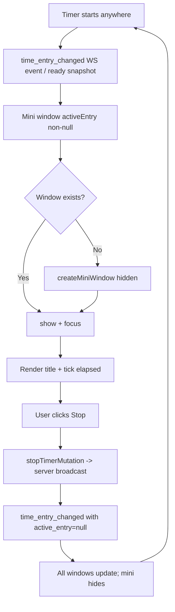

# Implementation Plan: Mini Timer Window (Pinnable Floating Widget)

## Overview

A small, always-on-top, taskbar-less floating window that shows the currently running time
entry (title + live elapsed time) with a **Stop** button, while the main app can stay
minimized or in the background.

**Decided behavior (from design discussion):**
- The window appears when a time entry is running.
- When the timer stops, the window **hides** (does not close).
- When a new entry starts (anywhere — main window, another device, auto-start), the
  window **reappears automatically**.
- Pin/unpin toggle switches `alwaysOnTop` on/off.
- Close button hides the window instead of destroying it.

## Why this works with almost no cross-window plumbing

Each Tauri window runs its own SvelteKit app instance, but all windows of the app share the
same origin, so they **share localStorage**. The existing WebSocket layer already gives every
window everything it needs:

- The WS `ready` frame carries `active_entry` (the serialized active entry, or `null`) —
  the mini window boots with current state instantly, no API call.
- `time_entry_changed` events carry the fresh `active_entry` snapshot and invalidate the
  TanStack time-entry queries — so a timer started/stopped on any device updates the mini
  window (and the main window) in real time.

The Stop button reuses the existing `useStopTimerMutation` → server broadcasts → **all**
windows (main + mini) update via WS. No `emit`/`listen` needed for state sync.

## Prerequisites (already in place — verify before starting)

- [x] `ready` frame includes `active_entry` (notifications consumer — DONE)
- [x] `time_entry_changed` events carry `active_entry` snapshot (DONE)
- [x] Permissions already granted in `src-tauri/capabilities/default.json`:
      `core:window:allow-set-always-on-top`, `allow-is-always-on-top`,
      `allow-start-dragging`, `allow-hide`, `core:window:allow-create-webview-window`
- [x] `tauri-plugin-store` already installed (use for position persistence)
- [x] App already creates runtime windows (`time-entries` via `WebviewWindow` in timer page)
- [x] App fully client-rendered (`ssr = false` in `+layout.ts`)

---

## Implementation Steps

### Step 1: Add the window label to capabilities

**File:** `src-tauri/capabilities/default.json`

The ACL is per-window: a window not listed here cannot call the granted APIs.

```json
"windows": [
  "main",
  "time-entries",
  "process-monitor",
  "mini-timer"
]
```

### Step 2: Window helper module

**New file:** `src/lib/miniWindow.ts`

Encapsulate create/show/hide/pin so the page code stays thin. Label must be unique —
creating again with the same label reuses the existing window (`WebviewWindow.getByLabel`).

```ts
import { WebviewWindow } from '@tauri-apps/api/webviewWindow';
import { LogicalPosition } from '@tauri-apps/api/dpi';

const LABEL = 'mini-timer';

export function isMiniWindow(): boolean {
  return (
    typeof window !== 'undefined' &&
    Boolean((window as any).__TAURI__ || (window as any).__TAURI_INTERNALS__) &&
    WebviewWindow.getCurrent().label === LABEL
  );
}

export function getMiniWindow(): WebviewWindow | null {
  return WebviewWindow.getByLabel(LABEL) ?? null;
}

export async function createMiniWindow(): Promise<WebviewWindow> {
  const existing = getMiniWindow();
  if (existing) return existing;

  const { x, y } = await loadSavedPosition(); // store plugin (see Step 5)

  const win = new WebviewWindow(LABEL, {
    url: `${window.location.origin}/mini`, // dev: localhost:1420, prod: served app
    title: 'Running Timer',
    width: 320,
    height: 130,
    minWidth: 280,
    minHeight: 110,
    resizable: false,
    alwaysOnTop: true,   // pinnable — toggle with setAlwaysOnTop
    skipTaskbar: true,   // floating widget, not a taskbar entry
    decorations: false,  // matches main window's custom chrome
    shadow: true,
    visible: false,      // show only when an entry is running
    x,
    y
  });

  win.once('tauri://error', (e) => console.error('mini window failed', e));
  return win;
}

export async function showMiniWindow(): Promise<void> {
  const win = (await createMiniWindow());
  await win.show();
  await win.setFocus();
}

export async function hideMiniWindow(): Promise<void> {
  const win = getMiniWindow();
  if (win) await win.hide();
}

export async function setMiniPinned(pinned: boolean): Promise<void> {
  const win = getMiniWindow();
  if (win) await win.setAlwaysOnTop(pinned);
}
```

Drag support (required — `decorations: false` means no native title bar): attach
`data-tauri-drag-region` or call `getCurrentWindow().startDragging()` on pointerdown in the
mini page's header area.

### Step 3: `/mini` route

**New files:**
- `src/routes/mini/+page.svelte`
- `src/routes/mini/+layout.svelte` (thin wrapper; see layout note below)

**Layout note:** the root `+layout.svelte` renders the app chrome (sidebar, etc.). The mini
window must be bare. Two options:

1. **(Recommended)** In the root `+layout.svelte`, gate the chrome:
   ```svelte
   {#if !isMiniWindow()}
     <!-- sidebar, topbar, toast container, etc. -->
   {/if}
   <slot />
   ```
   Keep the `PersistQueryClientProvider` + `$lib/notifications` init + `<slot/>` in both
   cases. The login redirect in the root layout must stay active for the mini window too
   (it shares the auth token from localStorage, so it boots straight in — but if the token
   is missing, redirect to `/` is correct).
2. Alternative: a nested layout under `routes/mini/` — but root layout chrome still wraps
   child layouts, so option 1 is required either way for a fully bare page.

**Page content** (`src/routes/mini/+page.svelte`):

```svelte
<script lang="ts">
  import { onMount } from 'svelte';
  import { useActiveTimer, useStopTimerMutation } from '$lib/queries/timeEntries';
  import { hideMiniWindow, setMiniPinned, isMiniWindow } from '$lib/miniWindow';
  import { getCurrentWindow } from '@tauri-apps/api/window';

  const activeQuery = useActiveTimer(); // WS-driven: ready snapshot + time_entry_changed
  const stopTimerMutation = useStopTimerMutation();
  let elapsed = $state(0);
  let pinned = $state(true);

  // Tick from start_time while an entry is active (same math as the timer page)
  $effect(() => {
    const entry = activeQuery.data;
    if (!entry) { elapsed = 0; return; }
    const start = Date.parse(entry.start_time);
    const tick = () => { elapsed = Math.max(0, Math.floor((Date.now() - start) / 1000)); };
    tick();
    const id = setInterval(tick, 1000);
    return () => clearInterval(id);
  });

  // Show/hide driven by active state: hide when idle, reappear on next start
  $effect(() => {
    if (isMiniWindow()) {
      if (activeQuery.data) show(); else hide();
    }
  });

  // Wire the drag region + close = hide
  onMount(() => {
    const unlisten = getCurrentWindow().onCloseRequested((e) => { e.preventDefault(); void hideMiniWindow(); });
    return () => { void unlisten.then((fn) => fn()); };
  });
</script>

<!-- UI: draggable header, title (truncated), ticking clock, Stop button, pin toggle -->
```

**UI sketch:**
```
┌─────────────────────────────────────────────┐
│  ⠿  {title}                    📌  ✕       │  ← drag region, pin toggle, close(=hide)
│                                             │
│            {HH:MM:SS elapsed}               │
│                  [⏹ Stop]                   │
└─────────────────────────────────────────────┘
```

When idle (window hidden), nothing renders. The page also renders a minimal "No active
timer" state in case it's shown without an entry (defensive).

### Step 4: Wire auto-show/auto-hide in the Timer page

**File:** `src/routes/timer/+page.svelte`

An `$effect` on `activeEntry` creates/shows the mini window when a timer starts and hides it
when it stops:

```ts
import { showMiniWindow, hideMiniWindow } from '$lib/miniWindow';

// Hide on stop / reappear on next start; create hidden on first use.
$effect(() => {
  if (activeEntry) void showMiniWindow();
  else void hideMiniWindow();
});
```

Notes:
- The mini window's own `$effect` also hides/shows it
-self, so this wiring is belt-and-braces
  (and covers the case where the main window is the one that started the timer).
- Add a manual toggle button ("Mini timer") on the Timer page for users who want the widget
  without auto-open, gated by a small setting (default: auto-open on start). Decide during
  implementation whether auto-open should be a persisted preference (`$lib/stores.ts`).

### Step 5: Position persistence (no new dependency)

**File:** `src/lib/miniWindow.ts` (helpers) — use the already-installed store plugin.

- On mini window close/move, save `{ x, y }` (physical or logical position from
  `getCurrentWindow().outerPosition()`).
- On create, restore saved position; fall back to a sensible default (bottom-right corner of
  the primary monitor or near the tray).

```ts
import { Store } from '@tauri-apps/plugin-store';
const store = await Store.load('mini-window.json');

async function loadSavedPosition(): Promise<{ x?: number; y?: number }> {
  const pos = await store.get<{ x: number; y: number }>('position');
  return pos ?? {};
}
// save: await store.set('position', { x, y }); await store.save();
```

Optional alternative (if preferred): add `tauri-plugin-window-state` (JS + Rust) — it saves
position/size/maximized state for every window automatically, but is a new dependency.

### Step 6 (optional, stretch): Tray + shortcut integration

- **Tray menu item** in `src-tauri/src/lib.rs` (`create_tray`): add a "Mini Timer" item that
  shows/hides the mini window (needs a small Rust command or the existing window handle).
- **Global shortcut**: `@tauri-apps/plugin-global-shortcut` is already in `package.json` —
  register e.g. `CommandOrControl+Shift+T` to toggle the mini window.

---

## Technical Considerations

- **Do NOT use the Rust `get_timer_state` / `stop_timer` commands** (`src-tauri/src/commands.rs`)
  — they are TODO stubs. The mini window must use the JS api layer (`useActiveTimer`,
  `useStopTimerMutation`) + the WebSocket, exactly like the main app.
- **Elapsed time** must tick from `entry.start_time` client-side (server stores UTC; display
  uses the same convention as the Timer page).
- **Multiple WS connections:** each window opens its own WebSocket connection + presence
  entry. The consumer already supports multiple connections per user; the admin online-users
  widget counts connections. Safe, but be aware.
- **Login guard:** the mini window shares the auth token from localStorage, so it connects
  immediately. If the token is missing/expired, the root layout redirect handles it (4401 on
  the WS clears the token — same as main window).
- **Dev vs prod URL:** use `${window.location.origin}/mini` — works for `devUrl`
  (localhost:1420) and packaged builds (localhost:8080 via tauri-plugin-localhost).
- **Duplicate windows:** always guard creation with `WebviewWindow.getByLabel(LABEL)`.
- **Styling:** reuse daisyui classes + the app's existing fonts/theme; keep the widget
  compact (320x130 default, `resizable: false`).
- **Window state on quit:** Tauri closes all windows on app exit; the mini window's position
  is persisted via Step 5 so it restores next launch.

---

## File Changes Summary

| File | Change |
|------|--------|
| `src-tauri/capabilities/default.json` | Add `"mini-timer"` to `windows` array |
| `src/lib/miniWindow.ts` | New: create/show/hide/pin helpers + position persistence |
| `src/routes/mini/+page.svelte` | New: title, elapsed, Stop, pin, close(=hide) |
| `src/routes/mini/+layout.svelte` | New (if needed): thin layout for the route |
| `src/routes/+layout.svelte` | Gate app chrome on `isMiniWindow()` |
| `src/routes/timer/+page.svelte` | `$effect` auto-show/hide + manual toggle button |
| `src/lib/stores.ts` (optional) | Persisted "auto-open mini window" preference |
| `src-tauri/src/lib.rs` (optional) | Tray menu item toggling the mini window |

---

## Testing Checklist

- [ ] Window appears when a timer starts (auto-open), at a sensible default position
- [ ] Shows the correct title and a live ticking elapsed time
- [ ] Stop button stops the timer; window hides; main window shows stopped state
- [ ] Starting a new timer (in the main window) makes the hidden window reappear
- [ ] Starting/stopping the timer from **another device** (WS event) updates the mini window
- [ ] Pin toggle flips always-on-top (verify with another window overlapping)
- [ ] Close button hides instead of destroys (reappears on next start)
- [ ] Window is draggable via its header
- [ ] Position persists across app restarts
- [ ] No duplicate windows on repeated start/stop cycles
- [ ] No login redirect loop when token is present; clean redirect when absent
- [ ] Works in dev (`bun run tauri dev`) and packaged build

---

## Implementation Flow Diagram


