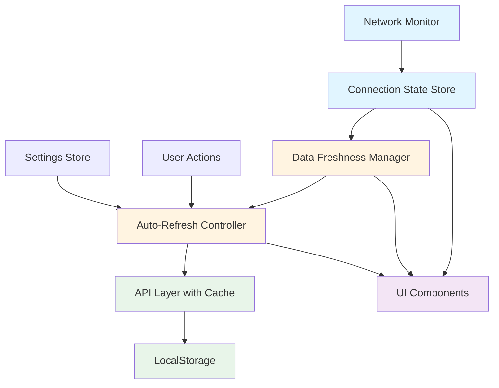
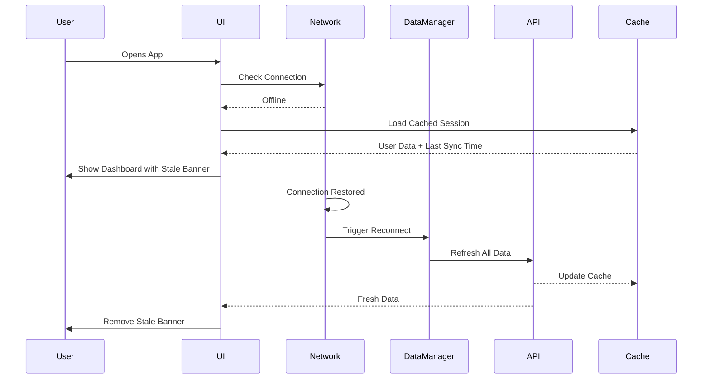

# Offline Mode & Connection Handling Enhancement Plan

## Overview

This plan details the improvements needed to make the Time Tracker app work seamlessly offline with proper data freshness indicators, connection status monitoring, and automatic reconnection handling.

## Current State Analysis

### ✅ What's Working

1. **Basic Network Detection** ([`src/lib/network.ts`](src/lib/network.ts:1))

   - Uses `navigator.onLine` API
   - Listens to online/offline events
   - Network store tracks connection status

2. **LocalStorage Caching** ([`src/lib/api.ts`](src/lib/api.ts:136))

   - API responses cached in memory and localStorage
   - 7-day TTL for cached data
   - Fallback to cache on API failures

3. **Basic Offline UI** ([`src/routes/+layout.svelte`](src/routes/+layout.svelte:243))

   - Red banner shown when offline
   - Login page shows offline screen ([`src/routes/+page.svelte`](src/routes/+page.svelte:212))

4. **Last Update Indicator** ([`src/routes/timer/+page.svelte`](src/routes/timer/+page.svelte:296))
   - Timestamp tracking on timer page
   - Shows last successful server sync

### ❌ Current Gaps

1. **Authentication Handling**

   - No automatic bypass to dashboard with cached data when offline
   - Auth check on login page times out after 3s but doesn't load cached session
   - User must wait or manually retry

2. **Data Freshness Tracking**

   - No global indication when data is outdated
   - No configurable threshold for "stale" data
   - Last update indicator only on timer page

3. **Connection Recovery**

   - No automatic data refresh on reconnection
   - No retry mechanism for failed requests
   - User must manually refresh browser

4. **Manual Refresh**

   - No explicit "Refresh" button
   - No way to force data sync
   - Auto-refresh interval not configurable

5. **Visual Indicators**
   - Inconsistent offline warnings across pages
   - No persistent data staleness indicator
   - No loading states during refresh

## Architecture Design

### System Components



### Data Flow



## Implementation Plan

### Phase 1: Enhanced Network & Data Tracking

#### 1.1 Extended Network Store ([`src/lib/network.ts`](src/lib/network.ts:1))

**Enhancements Needed:**

- Add connection quality detection (slow/fast)
- Track connection history (last online time)
- Add retry mechanism with exponential backoff
- Emit events on connection state changes

**New Features:**

```typescript
interface NetworkStatus {
	isOnline: boolean;
	isChecking: boolean;
	lastChecked: Date | null;
	lastOnline: Date | null; // NEW
	connectionType: 'online' | 'offline' | 'unknown';
	connectionQuality: 'fast' | 'slow' | 'unknown'; // NEW
	connectionInfo: any | null;
	retryCount: number; // NEW
}
```

#### 1.2 Data Freshness Manager (NEW: [`src/lib/dataFreshness.ts`](src/lib/dataFreshness.ts))

**Purpose:** Track when data was last updated and determine staleness

**Key Features:**

```typescript
import { writable, derived } from 'svelte/store';
import { DATA_STALE_THRESHOLD } from './stores';

interface DataFreshnessStatus {
	lastUpdate: Date | null;
	isFresh: boolean;
	isStale: boolean;
	age: number; // milliseconds since last update
	threshold: number; // staleness threshold constant
	isRefreshing: boolean; // NEW: Track if refresh in progress
}

// Internal store for timestamps
const timestampsStore = writable<Map<string, number>>(new Map());

// Internal store for refreshing state
const refreshingStore = writable<boolean>(false);

class DataFreshnessManager {
	// Track last update per data type
	updateTimestamp(key: string): void {
		timestampsStore.update((map) => {
			map.set(key, Date.now());
			return new Map(map);
		});
	}

	// Check if data is stale
	isStale(key: string): boolean {
		const map = get(timestampsStore);
		const timestamp = map.get(key);
		if (!timestamp) return true;
		return Date.now() - timestamp > DATA_STALE_THRESHOLD;
	}

	// Get all stale data keys
	getStaleData(): string[] {
		const map = get(timestampsStore);
		const now = Date.now();
		return Array.from(map.entries())
			.filter(([, timestamp]) => now - timestamp > DATA_STALE_THRESHOLD)
			.map(([key]) => key);
	}

	// Calculate data age
	getAge(key: string): number {
		const map = get(timestampsStore);
		const timestamp = map.get(key);
		return timestamp ? Date.now() - timestamp : Infinity;
	}

	// Set refreshing state
	setRefreshing(value: boolean): void {
		refreshingStore.set(value);
	}

	// Get refreshing state
	isRefreshing(): boolean {
		return get(refreshingStore);
	}
}

export const dataFreshnessManager = new DataFreshnessManager();

// CRITICAL: Derived store that UI always subscribes to
// This ensures UI always knows freshness state
export const dataFreshness = derived(
	[timestampsStore, refreshingStore, network],
	([$timestamps, $refreshing, $network]) => {
		const globalTimestamp = $timestamps.get('global');
		const lastUpdate = globalTimestamp ? new Date(globalTimestamp) : null;
		const age = lastUpdate ? Date.now() - lastUpdate.getTime() : Infinity;
		const isFresh = age < DATA_STALE_THRESHOLD;
		const isStale = !isFresh;

		return {
			lastUpdate,
			isFresh,
			isStale,
			age,
			threshold: DATA_STALE_THRESHOLD,
			isRefreshing: $refreshing,
			isOnline: $network.isOnline
		};
	}
);
```

**Integration Points:**

- Update timestamps in API layer after successful requests
- Check staleness in UI components via reactive store
- UI subscribes to `dataFreshness` for real-time state
- Trigger refresh when threshold exceeded

### Phase 2: Smart Authentication Bypass

#### 2.1 Offline-Aware Auth Context ([`src/lib/auth-context.ts`](src/lib/auth-context.ts))

**Current Behavior:**

- Login page checks auth token validity
- Redirects to dashboard if valid
- Shows error if network fails

**New Behavior:**

```typescript
async function checkAuthOffline() {
	// 1. Check if we have cached auth token
	const cachedToken = localStorage.getItem('authToken');
	const cachedUser = localStorage.getItem('user');

	// 2. Check network status
	const isOnline = get(network).isOnline;

	if (!isOnline && cachedToken && cachedUser) {
		// 3. Load user from cache without API call
		authToken.set(cachedToken);
		user.set(JSON.parse(cachedUser));

		// 4. Redirect to dashboard with offline flag
		goto('/dashboard?offline=true');
		return true;
	}

	if (isOnline) {
		// 5. Validate token with API as usual
		return checkAuthOnline();
	}

	// 6. No cached data and offline
	return false;
}
```

#### 2.2 Offline Timer Behavior

**Important Constants:**

```typescript
// How long to consider cached active timer valid
const ACTIVE_TIMER_VALIDITY_THRESHOLD = 4 * 60 * 60 * 1000; // 4 hours

// Check if cached timer is still valid
function isActiveTimerValid(timer: TimeEntry | null): boolean {
	if (!timer || !timer.is_active) return false;

	const startTime = new Date(timer.start_time).getTime();
	const age = Date.now() - startTime;

	return age <= ACTIVE_TIMER_VALIDITY_THRESHOLD;
}
```

**Timer Page Offline Behavior:**

```typescript
// When offline:
// 1. Show active timer if exists and is within 4hr threshold
if (!$network.isOnline) {
	if (activeEntry && isActiveTimerValid(activeEntry)) {
		// Display timer with warning that it can't be stopped
		// Timer continues counting client-side
		// Show message: "Timer can't be stopped while offline"
	} else {
		// Hide active timer if too old
		activeEntry = null;
	}

	// 2. Disable start button with clear message
	// "Cannot start new timer while offline"

	// 3. Disable stop button with message
	// "Cannot stop timer while offline"
}
```

#### 2.3 Login Page Updates ([`src/routes/+page.svelte`](src/routes/+page.svelte:1))

**Changes:**

1. Remove 3-second timeout on auth check
2. Add offline mode detection
3. Auto-redirect to dashboard if cached session exists
4. Show "Continue Offline" button if cached data available

**UI Flow:**

```
┌─────────────────────────────────────┐
│   App Opened - Checking Auth...    │
├─────────────────────────────────────┤
│ ┌─ Has Cached Token? ──────────┐   │
│ │                               │   │
│ │  Yes + Online                 │   │
│ │    → Validate with API        │   │
│ │    → Redirect to Dashboard    │   │
│ │                               │   │
│ │  Yes + Offline                │   │
│ │    → Auto-redirect with cache │   │
│ │    → Show stale warning       │   │
│ │                               │   │
│ │  No + Online                  │   │
│ │    → Show login form          │   │
│ │                               │   │
│ │  No + Offline                 │   │
│ │    → Show offline screen      │   │
│ │    → No login possible        │   │
│ └───────────────────────────────┘   │
└─────────────────────────────────────┘
```

### Phase 3: Visual Indicators & UI Components

#### 3.1 Connection Status Banner (Global)

**Location:** [`src/routes/+layout.svelte`](src/routes/+layout.svelte:243)

**Current:**

- Simple red banner when offline
- Shows only in main layout

**Enhanced Version:**

```svelte
{#if !$network.isOnline}
	<div class="alert alert-error px-4 py-3 shadow-lg sticky top-16 lg:top-0 z-40">
		<div class="flex items-center justify-between w-full">
			<div class="flex items-center gap-3">
				<!-- Pulsing offline icon -->
				<span class="relative flex h-3 w-3">
					<span
						class="animate-ping absolute inline-flex h-full w-full rounded-full bg-white opacity-75"
					></span>
					<span class="relative inline-flex rounded-full h-3 w-3 bg-white"></span>
				</span>

				<div class="flex flex-col">
					<span class="font-bold">No Internet Connection</span>
					<span class="text-sm opacity-90">
						Showing cached data from {formatLastOnline($network.lastOnline)}
					</span>
				</div>
			</div>

			<!-- Reconnection status -->
			{#if $network.isChecking}
				<div class="flex items-center gap-2">
					<span class="loading loading-spinner loading-sm"></span>
					<span class="text-sm">Reconnecting...</span>
				</div>
			{/if}
		</div>
	</div>
{/if}
```

#### 3.2 Data Freshness Indicator Component (NEW: [`src/lib/DataFreshnessIndicator.svelte`](src/lib/DataFreshnessIndicator.svelte))

**Purpose:** Show data age and provide manual refresh

**Features:**

- Shows last update timestamp
- Color-coded freshness status
- Manual refresh button (always visible)
- Loading state during refresh
- Auto-refresh countdown (optional)

**Visual Design:**

```
┌─────────────────────────────────────────────┐
│  ⟳  Last updated: 2 minutes ago      [Fresh] │
│      Next refresh in: 3m 45s                │
│                                     [Refresh]│
└─────────────────────────────────────────────┘

Stale version:
┌─────────────────────────────────────────────┐
│  ⚠  Last updated: 35 minutes ago    [Stale] │
│      Auto-refresh disabled                  │
│                                     [Refresh]│
└─────────────────────────────────────────────┘
```

**Implementation:**

```svelte
<script lang="ts">
	import { dataFreshness } from '$lib/dataFreshness';
	import { network } from '$lib/network';
	import { autoRefreshEnabled, refreshInterval } from '$lib/stores';

	let { onRefresh } = $props<{ onRefresh: () => Promise<void> }>();

	let refreshing = $state(false);
	let countdown = $state(0);

	async function handleRefresh() {
		refreshing = true;
		try {
			await onRefresh();
		} finally {
			refreshing = false;
		}
	}

	$effect(() => {
		if ($autoRefreshEnabled && $network.isOnline) {
			// Start countdown timer
			const interval = setInterval(() => {
				countdown = calculateCountdown();
			}, 1000);

			return () => clearInterval(interval);
		}
	});
</script>

<div class="flex items-center gap-4 p-3 bg-base-200 rounded-lg">
	<!-- Status indicator -->
	<div class="flex items-center gap-2">
		{#if $dataFreshness.isFresh}
			<span class="badge badge-success badge-sm">Fresh</span>
		{:else}
			<span class="badge badge-warning badge-sm">Stale</span>
		{/if}

		<span class="text-sm text-base-content/70">
			Last updated: {formatAge($dataFreshness.age)}
		</span>
	</div>

	<!-- Auto-refresh countdown -->
	{#if $autoRefreshEnabled && $network.isOnline}
		<span class="text-xs text-base-content/60">
			Next refresh in: {formatCountdown(countdown)}
		</span>
	{/if}

	<!-- Manual refresh button -->
	<button
		class="btn btn-sm btn-ghost gap-2"
		onclick={handleRefresh}
		disabled={refreshing || !$network.isOnline}
	>
		{#if refreshing}
			<span class="loading loading-spinner loading-xs"></span>
			Refreshing...
		{:else}
			<svg class="w-4 h-4" fill="none" stroke="currentColor" viewBox="0 0 24 24">
				<path
					stroke-linecap="round"
					stroke-linejoin="round"
					stroke-width="2"
					d="M4 4v5h.582m15.356 2A8.001 8.001 0 004.582 9m0 0H9m11 11v-5h-.581m0 0a8.003 8.003 0 01-15.357-2m15.357 2H15"
				/>
			</svg>
			Refresh
		{/if}
	</button>
</div>
```

#### 3.3 Page-Level Integration

**Timer Page** ([`src/routes/timer/+page.svelte`](src/routes/timer/+page.svelte:583)):

- Replace current last update indicator with `DataFreshnessIndicator`
- Add refresh handler that calls `refreshAllData()`

**Dashboard Page** ([`src/routes/dashboard/+page.svelte`](src/routes/dashboard/+page.svelte:1)):

- Add `DataFreshnessIndicator` to header
- Implement refresh handler for dashboard data

**Other Pages:**

- Add similar indicators to entries, profile, and settings pages
- Each with appropriate refresh handlers

### Phase 4: Auto-Refresh System

#### 4.1 Refresh Controller (NEW: [`src/lib/refreshController.ts`](src/lib/refreshController.ts))

**Purpose:** Centralized auto-refresh logic with reconnection handling

**Key Features:**

```typescript
interface RefreshConfig {
	enabled: boolean;
	interval: number; // milliseconds
	onlyWhenVisible: boolean; // pause when tab not visible
	refreshOnReconnect: boolean;
}

class RefreshController {
	private intervalId: number | null = null;
	private config: RefreshConfig;
	private refreshCallbacks: Map<string, () => Promise<void>>;
	private isRefreshing: boolean = false; // NEW: Prevent concurrent refreshes
	private wasOnline: boolean = false; // Track connection state

	constructor(config: RefreshConfig) {
		this.config = config;
		this.refreshCallbacks = new Map();
		this.wasOnline = get(network).isOnline;

		// Listen for network changes
		network.subscribe((status) => {
			if (status.isOnline && !this.wasOnline && this.config.refreshOnReconnect) {
				// Connection restored
				console.log('Connection restored, triggering refresh');
				this.refreshAll();
			}
			this.wasOnline = status.isOnline;
		});

		// Listen for visibility changes
		if (this.config.onlyWhenVisible) {
			document.addEventListener('visibilitychange', () => {
				if (document.hidden) {
					this.pause();
				} else {
					this.resume();
				}
			});
		}
	}

	start(): void {
		if (!this.config.enabled) return;

		this.stop(); // Clear existing interval

		this.intervalId = setInterval(() => {
			this.refreshAll();
		}, this.config.interval);
	}

	stop(): void {
		if (this.intervalId) {
			clearInterval(this.intervalId);
			this.intervalId = null;
		}
	}

	pause(): void {
		this.stop();
	}

	resume(): void {
		this.start();
	}

	register(key: string, callback: () => Promise<void>): void {
		this.refreshCallbacks.set(key, callback);
	}

	unregister(key: string): void {
		this.refreshCallbacks.delete(key);
	}

	async refreshAll(): Promise<void> {
		// CRITICAL: Only one refresh at a time
		if (this.isRefreshing) {
			console.log('Refresh already in progress, skipping');
			return;
		}

		// CRITICAL: No API calls when offline
		if (!get(network).isOnline) {
			console.log('Offline, skipping refresh');
			return;
		}

		this.isRefreshing = true;

		try {
			const promises = Array.from(this.refreshCallbacks.values()).map((callback) =>
				callback().catch((err) => {
					console.error('Refresh callback failed:', err);
					return Promise.resolve(); // Don't fail entire refresh
				})
			);

			await Promise.allSettled(promises);

			// Update global freshness timestamp after successful refresh
			dataFreshnessManager.updateTimestamp('global');
		} finally {
			this.isRefreshing = false;
		}
	}

	// Expose refreshing state for UI
	getRefreshingState(): boolean {
		return this.isRefreshing;
	}

	updateConfig(newConfig: Partial<RefreshConfig>): void {
		this.config = { ...this.config, ...newConfig };

		if (this.config.enabled) {
			this.start();
		} else {
			this.stop();
		}
	}
}

export const refreshController = new RefreshController({
	enabled: true,
	interval: 30000, // default 30s
	onlyWhenVisible: true,
	refreshOnReconnect: true
});
```

#### 4.2 Integration with Pages

**Pattern for Each Page:**

```typescript
onMount(() => {
	// Register refresh callback
	refreshController.register('timer-page', async () => {
		await refreshAllData();
	});

	// Cleanup
	return () => {
		refreshController.unregister('timer-page');
	};
});
```

#### 4.3 Reconnection Handler with Toast Notifications

**Automatic Refresh on Reconnect:**

```typescript
// In refreshController constructor
network.subscribe((status) => {
	if (status.isOnline && !this.wasOnline) {
		console.log('Connection restored, refreshing all data...');

		// Show success toast
		toast.success('Connection restored! Refreshing data...', {
			duration: 3000,
			icon: '✓'
		});

		// Trigger immediate refresh
		this.refreshAll()
			.then(() => {
				toast.success('Data refreshed successfully', {
					duration: 2000
				});
			})
			.catch((err) => {
				toast.error('Failed to refresh some data', {
					duration: 3000
				});
			});
	} else if (!status.isOnline && this.wasOnline) {
		// Connection lost
		toast.error('Connection lost. Working in offline mode.', {
			duration: 4000,
			icon: '⚠'
		});
	}

	this.wasOnline = status.isOnline;
});
```

**Toast Notification Library:**
The app already has a toast system at [`src/lib/toast.ts`](src/lib/toast.ts:1), so we'll use that for consistency.

### Phase 5: Settings Configuration

#### 5.1 New Settings Store Entries ([`src/lib/stores.ts`](src/lib/stores.ts:1))

**Add:**

```typescript
// Auto-refresh settings
export const autoRefreshEnabled = createPersistentStore<boolean>('autoRefreshEnabled', true);

export const refreshInterval = createPersistentStore<number>(
	'refreshInterval',
	30000 // 30 seconds default
);

export const refreshOnReconnect = createPersistentStore<boolean>('refreshOnReconnect', true);

export const refreshOnlyWhenVisible = createPersistentStore<boolean>(
	'refreshOnlyWhenVisible',
	true
);

// Data staleness threshold (milliseconds)
// Note: This is a constant, not user-configurable, but easy to change here
export const DATA_STALE_THRESHOLD = 24 * 60 * 60 * 1000; // 1 day

// Active timer validity threshold (milliseconds)
// How long to show cached active timer when offline
export const ACTIVE_TIMER_VALIDITY_THRESHOLD = 4 * 60 * 60 * 1000; // 4 hours
```

#### 5.2 Settings UI ([`src/routes/settings/+page.svelte`](src/routes/settings/+page.svelte:1))

**New Section: "Data Refresh Settings"**

```svelte
<div class="form-control">
	<label class="label">
		<span class="label-text">Auto-Refresh</span>
		<input type="checkbox" class="toggle toggle-primary" bind:checked={$autoRefreshEnabled} />
	</label>
	<label class="label">
		<span class="label-text-alt"> Automatically refresh data at regular intervals </span>
	</label>
</div>

{#if $autoRefreshEnabled}
	<div class="form-control">
		<label class="label">
			<span class="label-text">Refresh Interval</span>
		</label>
		<select class="select select-bordered" bind:value={$refreshInterval}>
			<option value={30000}>30 seconds</option>
			<option value={120000}>2 minutes</option>
			<option value={300000}>5 minutes</option>
			<option value={600000}>10 minutes</option>
			<option value={1800000}>30 minutes</option>
			<option value={0}>Manual only</option>
		</select>
	</div>
{/if}

<div class="form-control">
	<label class="label">
		<span class="label-text">Refresh on Reconnect</span>
		<input type="checkbox" class="toggle toggle-primary" bind:checked={$refreshOnReconnect} />
	</label>
	<label class="label">
		<span class="label-text-alt"> Automatically refresh when internet connection is restored </span>
	</label>
</div>

<div class="form-control">
	<label class="label">
		<span class="label-text">Pause When Inactive</span>
		<input type="checkbox" class="toggle toggle-primary" bind:checked={$refreshOnlyWhenVisible} />
	</label>
	<label class="label">
		<span class="label-text-alt"> Pause auto-refresh when browser tab is not visible </span>
	</label>
</div>

<!-- Data staleness threshold is now a constant (1 day) and not user-configurable -->
```

#### 5.3 Settings Reactivity

**Wire up settings to RefreshController:**

```typescript
// React to settings changes
$effect(() => {
	refreshController.updateConfig({
		enabled: $autoRefreshEnabled,
		interval: $refreshInterval || 0,
		onlyWhenVisible: $refreshOnlyWhenVisible,
		refreshOnReconnect: $refreshOnReconnect
	});
});
```

### Phase 6: Enhanced API Layer

#### 6.1 API Cache Improvements ([`src/lib/api.ts`](src/lib/api.ts:136))

**Current Issues:**

- Cache doesn't track staleness properly
- No differentiation between "stale but usable" and "expired"
- No cache invalidation strategy

**Enhancements:**

```typescript
interface CacheEntry<T> {
	data: T;
	timestamp: number;
	ttl: number;
	lastValidated: number; // NEW: last time verified with server
	isStale: boolean; // NEW: calculated based on threshold
}

// Enhanced getCached function
function getCached<T>(key: string, allowStale: boolean = false): T | null {
	const cached = apiCache.get(key);

	if (!cached) return null;

	const age = Date.now() - cached.timestamp;
	const isExpired = age > cached.ttl;
	const isStale = age > get(dataStaleThreshold);

	if (isExpired && !allowStale) {
		// Remove expired cache
		apiCache.delete(key);
		localStorage.removeItem(LOCALSTORAGE_PREFIX + key);
		return null;
	}

	if (isStale && !allowStale) {
		console.warn(`Cache for ${key} is stale (${age}ms old)`);
	}

	return cached.data;
}

// Enhanced fetchWithCache with offline protection
export async function fetchWithCache<T>(
	key: string,
	fetchFn: () => Promise<T>,
	ttl: number = CACHE_TTL,
	allowStale: boolean = true // NEW: allow stale data as fallback
): Promise<{ data: T | null; stale: boolean; cached: boolean }> {
	// CRITICAL: No API calls when offline - return cache immediately
	if (!get(network).isOnline) {
		console.log(`Offline: returning cached data for ${key}`);
		const cached = getCached<T>(key, allowStale);

		if (cached) {
			return { data: cached, stale: true, cached: true };
		}

		console.warn(`No cached data available for ${key} while offline`);
		return { data: null, stale: true, cached: false };
	}

	try {
		// Try fresh fetch (only when online)
		const data = await fetchFn();
		setCached(key, data, ttl);

		// Update freshness tracker
		dataFreshnessManager.updateTimestamp(key);

		return { data, stale: false, cached: false };
	} catch (error) {
		console.warn(`API call failed for ${key}, trying cache...`, error);

		// Fallback to cache (even if stale)
		const cached = getCached<T>(key, allowStale);

		if (cached) {
			console.log(`Using ${allowStale ? 'stale' : 'fresh'} cached data for ${key}`);
			return { data: cached, stale: true, cached: true };
		}

		return { data: null, stale: true, cached: false };
	}
}
```

#### 6.2 Network-Aware Retry Logic

**Add smart retry for failed requests:**

```typescript
async function fetchWithRetry<T>(
	fetchFn: () => Promise<T>,
	maxRetries: number = 3,
	backoff: number = 1000
): Promise<T> {
	let lastError: Error;

	for (let i = 0; i < maxRetries; i++) {
		try {
			return await fetchFn();
		} catch (error) {
			lastError = error as Error;

			// Don't retry if offline
			if (!get(network).isOnline) {
				throw error;
			}

			// Don't retry 4xx errors (except 429)
			if (
				error.response?.status >= 400 &&
				error.response?.status < 500 &&
				error.response?.status !== 429
			) {
				throw error;
			}

			// Wait with exponential backoff
			const delay = backoff * Math.pow(2, i);
			console.log(`Retry ${i + 1}/${maxRetries} after ${delay}ms`);
			await new Promise((resolve) => setTimeout(resolve, delay));
		}
	}

	throw lastError!;
}
```

## Testing Strategy

### Test Scenarios

#### 1. **Offline App Start**

- ✓ User has cached credentials
- ✓ App opens directly to dashboard
- ✓ Offline banner visible
- ✓ Data staleness indicator shows age
- ✓ All cached data renders correctly

#### 2. **Connection Loss During Usage**

- ✓ User is on timer page
- ✓ Internet disconnects
- ✓ Toast notification: "Connection lost. Working in offline mode."
- ✓ Offline banner appears immediately
- ✓ Active timer continues counting (client-side only)
- ✓ Stop button disabled with tooltip: "Cannot stop timer while offline"
- ✓ Start button disabled with tooltip: "Cannot start timer while offline"
- ✓ Cached data still accessible and displays normally

#### 3. **Connection Restored**

- ✓ Internet reconnects
- ✓ Toast notification: "Connection restored! Refreshing data..."
- ✓ Offline banner disappears
- ✓ Auto-refresh triggers immediately
- ✓ Second toast on success: "Data refreshed successfully"
- ✓ Data freshness indicator updates to "Fresh"
- ✓ Start/Stop buttons re-enabled
- ✓ Active timer syncs with server state

#### 4. **Stale Data Warning**

- ✓ Data not refreshed for > threshold time
- ✓ Staleness indicator changes color/badge
- ✓ Warning message explains situation
- ✓ Refresh button remains accessible

#### 5. **Manual Refresh**

- ✓ Click refresh button
- ✓ Loading state shown
- ✓ All page data re-fetched
- ✓ Freshness timestamp updates
- ✓ Success/error feedback provided

#### 6. **Settings Configuration**

- ✓ Change refresh interval
- ✓ Auto-refresh timer adjusts
- ✓ Disable auto-refresh
- ✓ Manual refresh still works
- ✓ Enable reconnect refresh
- ✓ Test reconnection behavior

#### 7. **Cache Persistence**

- ✓ Close and reopen app
- ✓ Cached data still available
- ✓ Timestamps preserved
- ✓ Stale/fresh status correct

#### 8. **Active Timer Validity (Offline)**

- ✓ Active timer cached < 4 hours old
- ✓ Opens offline → timer displayed and counting
- ✓ Buttons disabled with appropriate messages
- ✓ Active timer cached > 4 hours old
- ✓ Opens offline → timer not displayed
- ✓ Shows "Start new timer" form (disabled)

### Testing Tools

**Network Simulation:**

```typescript
// Development helper to simulate network conditions
if (import.meta.env.DEV) {
	window.__debugNetwork = {
		// Force offline mode
		goOffline: () => {
			window.dispatchEvent(new Event('offline'));
		},

		// Force online mode
		goOnline: () => {
			window.dispatchEvent(new Event('online'));
		},

		// Simulate slow connection
		simulateSlow: () => {
			// Add artificial delay to API calls
		},

		// Clear all cache
		clearCache: () => {
			apiCache.clear();
			localStorage.clear();
		}
	};
}
```

## Implementation Priority

### Phase 1 (High Priority) - Core Offline Functionality

1. ✅ Enhanced network store with connection history
2. ✅ Data freshness manager
3. ✅ Smart authentication bypass for offline mode
4. ✅ Offline banner improvements

### Phase 2 (High Priority) - Visual Feedback

5. ✅ Data freshness indicator component
6. ✅ Manual refresh button (always visible)
7. ✅ Page-level integration (timer, dashboard)

### Phase 3 (Medium Priority) - Auto-Refresh

8. ✅ Refresh controller with reconnection handling
9. ✅ Settings store entries
10. ✅ Settings UI for configuration

### Phase 4 (Medium Priority) - Enhanced Caching

11. ✅ Improved cache staleness tracking
12. ✅ Network-aware retry logic
13. ✅ Cache invalidation strategy

### Phase 5 (Low Priority) - Testing & Polish

14. ✅ Comprehensive testing scenarios
15. ✅ Development debugging tools
16. ✅ Documentation updates

## Success Criteria

### User Experience

- [ ] App works fully offline with cached data
- [ ] Clear indication of connection status at all times
- [ ] Users can see data age and freshness
- [ ] Manual refresh always available
- [ ] Automatic reconnection with refresh
- [ ] No confusing loading states or timeouts

### Technical

- [ ] No API calls when offline
- [ ] Efficient cache management
- [ ] Proper error handling
- [ ] Configurable refresh intervals
- [ ] Network state properly tracked
- [ ] Data freshness accurately calculated

### Performance

- [ ] Instant offline detection (<100ms)
- [ ] Fast dashboard load from cache (<500ms)
- [ ] Smooth transitions between online/offline
- [ ] No unnecessary re-renders
- [ ] Efficient localStorage usage

## Future Enhancements

### Post-MVP Improvements

1. **Offline Queue**

   - Queue actions (start/stop timer) while offline
   - Sync when connection restored
   - Conflict resolution

2. **Smart Caching**

   - Predictive cache warming
   - Most-used data prioritization
   - Cache size management

3. **Background Sync**

   - Use Service Workers for background sync
   - PWA manifest for install prompt
   - Offline-first architecture

4. **Analytics**
   - Track offline usage patterns
   - Monitor cache hit rates
   - Connection quality metrics

## Files to Modify

### New Files

- `src/lib/dataFreshness.ts` - Data freshness tracking
- `src/lib/refreshController.ts` - Auto-refresh logic
- `src/lib/DataFreshnessIndicator.svelte` - UI component
- `plans/offline-mode-enhancement-plan.md` - This file

### Modified Files

- [`src/lib/network.ts`](src/lib/network.ts:1) - Enhanced network tracking
- [`src/lib/api.ts`](src/lib/api.ts:1) - Improved caching and retry logic
- [`src/lib/stores.ts`](src/lib/stores.ts:1) - New settings stores
- [`src/lib/auth-context.ts`](src/lib/auth-context.ts) - Offline auth bypass
- [`src/routes/+page.svelte`](src/routes/+page.svelte:1) - Login offline handling
- [`src/routes/+layout.svelte`](src/routes/+layout.svelte:1) - Enhanced offline banner
- [`src/routes/timer/+page.svelte`](src/routes/timer/+page.svelte:1) - Integrate freshness indicator
- [`src/routes/dashboard/+page.svelte`](src/routes/dashboard/+page.svelte:1) - Add refresh handling
- [`src/routes/settings/+page.svelte`](src/routes/settings/+page.svelte:1) - New settings UI

## Estimated Complexity

| Phase   | Complexity | Risk Level | Dependencies |
| ------- | ---------- | ---------- | ------------ |
| Phase 1 | Medium     | Low        | None         |
| Phase 2 | Low        | Low        | Phase 1      |
| Phase 3 | Medium     | Medium     | Phase 1, 2   |
| Phase 4 | High       | Medium     | Phase 1      |
| Phase 5 | Low        | Low        | All phases   |

**Total Implementation Time:** Approximately 2-3 development sessions

---

## Questions for Clarification - ALL CONFIRMED ✅

1. ✅ Auto-refresh intervals: 30s, 2min, 5min, 10min, 30min, manual
2. ✅ Auto-refresh immediately on reconnect
3. ✅ Fresh button always visible
4. ✅ Data staleness threshold: 1 day (constant, easy to change in code)
5. ✅ Offline actions: **Block start/stop timer when offline**
   - Show existing active timer if within threshold
   - Active timer validity threshold: **4 hours** (constant, easy to change)
6. ✅ Toast notifications: **Yes, show toast on reconnection**

---

## Tauri & Browser Compatibility

### Environment Detection

All new code must check for Tauri environment and gracefully fallback:

```typescript
// Helper to detect Tauri
export function isTauriEnv(): boolean {
	return typeof window !== 'undefined' && !!(window as any).__TAURI__;
}

// Helper to detect browser
export function isBrowserEnv(): boolean {
	return typeof window !== 'undefined' && !(window as any).__TAURI__;
}
```

### Storage Strategy by Environment

**Tauri Environment:**

- Use `@tauri-apps/plugin-store` for persistent settings
- Already implemented in current codebase
- More reliable than localStorage on desktop

**Browser Environment:**

- Use localStorage as fallback
- Works in development and web deployment
- Already implemented with dual-storage pattern

**Implementation Pattern:**

```typescript
// Already used in stores.ts - continue this pattern
async function setTauriSetting(key: string, value: any): Promise<void> {
	try {
		const store = await initializeTauriSettingsStore();
		if (store) {
			await store.set(key, value);
			await store.save();
		}
	} catch (e) {
		logger.error(`Failed to save to Tauri store: ${key}`, e);
	}

	// Always fallback to localStorage for browser compatibility
	if (browser) {
		try {
			localStorage.setItem(key, JSON.stringify(value));
		} catch (e) {
			logger.error(`Failed to save to localStorage: ${key}`, e);
		}
	}
}
```

### Network Detection Considerations

**Tauri-Specific:**

```typescript
// Enhanced network detection for Tauri
async function enhancedNetworkCheck(): Promise<boolean> {
	// 1. First check navigator.onLine (works in both)
	if (!navigator.onLine) return false;

	// 2. In Tauri, we can ping local server or use Tauri's HTTP client
	if (isTauriEnv()) {
		try {
			// Use Tauri's fetch which respects system network settings
			const { fetch: tauriFetch } = await import('@tauri-apps/plugin-http');
			const response = await tauriFetch(get(baseUrl) + '/health', {
				method: 'GET',
				connectTimeout: 3000
			});
			return response.ok;
		} catch {
			return false;
		}
	}

	// 3. In browser, use regular fetch
	try {
		const controller = new AbortController();
		const timeout = setTimeout(() => controller.abort(), 3000);
		await fetch(get(baseUrl) + '/health', { signal: controller.signal });
		clearTimeout(timeout);
		return true;
	} catch {
		return false;
	}
}
```

**Why This Matters:**

- Tauri apps might have different network stack behaviors
- System-level network changes detected differently
- Tauri's HTTP client respects system proxy settings

### Toast Notifications

**Current Implementation:**
The app already has [`src/lib/toast.ts`](src/lib/toast.ts:1) which works in both environments.

**Tauri Enhancement (Optional):**

```typescript
// Can use Tauri's native notifications for desktop
async function showToast(message: string, type: 'success' | 'error' | 'warning') {
	// 1. Show in-app toast (works everywhere)
	toast[type](message);

	// 2. Optionally show OS-level notification in Tauri
	if (isTauriEnv()) {
		try {
			const { isPermissionGranted, requestPermission, sendNotification } = await import(
				'@tauri-apps/plugin-notification'
			);

			let permissionGranted = await isPermissionGranted();
			if (!permissionGranted) {
				const permission = await requestPermission();
				permissionGranted = permission === 'granted';
			}

			if (permissionGranted) {
				sendNotification({
					title: 'Time Tracker',
					body: message
				});
			}
		} catch (e) {
			// Silently fail - in-app toast still shown
			console.warn('Native notification failed:', e);
		}
	}
}
```

### Data Persistence

**Cache Storage Locations:**

| Environment | Primary Storage               | Fallback       |
| ----------- | ----------------------------- | -------------- |
| Tauri       | Tauri Store (`settings.json`) | localStorage   |
| Browser     | localStorage                  | sessionStorage |

**Cache Keys:**

```typescript
// Already implemented pattern - keep using this
const LOCALSTORAGE_PREFIX = 'api_cache_';

// Save to both in Tauri
function saveCacheEntry(key: string, data: any): void {
	// 1. Memory cache (fast access)
	apiCache.set(key, { data, timestamp: Date.now(), ttl });

	// 2. localStorage (browser & Tauri fallback)
	if (browser) {
		localStorage.setItem(LOCALSTORAGE_PREFIX + key, JSON.stringify(data));
	}

	// 3. Tauri store (Tauri only, persists across app updates)
	if (isTauriEnv()) {
		// Optional: save to Tauri store for important data
		// Most cache can stay in localStorage for simplicity
	}
}
```

### Window Management

**Browser:**

- Uses tabs/windows normally
- `window.open()` for new views

**Tauri:**

- Uses `WebviewWindow` for native windows
- Already implemented in timer.svelte and dashboard.svelte

**Pattern to Keep:**

```typescript
// Already used - maintain this pattern
async function openInNewWindow(path: string, title: string) {
	try {
		const { getCurrentWindow } = await import('@tauri-apps/api/window');
		getCurrentWindow(); // Test if Tauri

		const { WebviewWindow } = await import('@tauri-apps/api/webviewWindow');
		new WebviewWindow(title, {
			url: `${window.location.origin}${path}`,
			title,
			width: 1000,
			height: 700
		});
	} catch {
		// Browser fallback
		window.open(path, '_blank');
	}
}
```

### Event System

**Tauri Events:**

- Already used for timer events
- Use for connection state broadcasting between windows

**Implementation:**

```typescript
// Broadcast connection changes to all Tauri windows
if (isTauriEnv()) {
	network.subscribe(async (status) => {
		try {
			const { emit } = await import('@tauri-apps/api/event');
			await emit('network-status-changed', status);
		} catch (e) {
			console.warn('Failed to emit network status:', e);
		}
	});

	// Listen in other windows
	const { listen } = await import('@tauri-apps/api/event');
	await listen('network-status-changed', (event) => {
		// Update local network store
		network.set(event.payload);
	});
}
```

### File System Access (Tauri Only)

**Not Needed for This Feature**, but good to know:

- Cache could theoretically be saved to app data directory
- Use `@tauri-apps/plugin-fs` for advanced caching strategies
- localStorage is sufficient for current needs

### Testing Checklist

#### Tauri-Specific Tests

- [ ] Network detection works on Windows/Mac/Linux
- [ ] Settings persist after app restart
- [ ] Cache persists after app restart
- [ ] Multiple windows sync connection state
- [ ] System proxy settings respected
- [ ] App works without internet on first launch (with cache)

#### Browser-Specific Tests

- [ ] Works in Chrome, Firefox, Edge, Safari
- [ ] localStorage limits handled gracefully
- [ ] Multiple tabs sync connection state (via localStorage events)
- [ ] Incognito mode degradation acceptable
- [ ] Works without Tauri APIs

#### Cross-Environment Tests

- [ ] All features work in both environments
- [ ] No Tauri import errors in browser
- [ ] No missing features in Tauri
- [ ] Consistent UX across environments

## Critical Safeguards

### 1. Only One Refresh at a Time

**Problem:** Multiple refresh triggers (manual, auto, reconnect) could fire simultaneously.

**Solution:**

```typescript
class RefreshController {
	private isRefreshing: boolean = false;

	async refreshAll(): Promise<void> {
		// Guard: Skip if already refreshing
		if (this.isRefreshing) {
			console.log('Refresh already in progress, skipping');
			return;
		}

		this.isRefreshing = true;
		try {
			// ... refresh logic
		} finally {
			this.isRefreshing = false; // Always reset
		}
	}
}
```

**Benefits:**

- Prevents duplicate API calls
- Avoids race conditions
- Reduces server load
- Better user experience (no stacked loading states)

### 2. No API Calls When Offline

**Problem:** API calls while offline waste resources and cause errors.

**Solution:**

```typescript
export async function fetchWithCache<T>(...) {
  // Guard: Return cached data immediately when offline
  if (!get(network).isOnline) {
    console.log(`Offline: returning cached data`);
    return { data: getCached(key), stale: true, cached: true };
  }

  // Only attempt fetch when online
  try {
    const data = await fetchFn();
    // ...
  }
}

// In RefreshController
async refreshAll(): Promise<void> {
  if (this.isRefreshing) return;

  // Guard: Skip refresh entirely when offline
  if (!get(network).isOnline) {
    console.log('Offline, skipping refresh');
    return;
  }

  // ... refresh logic
}
```

**Benefits:**

- Zero wasted network requests
- Instant responses from cache
- Battery life preservation (important for Tauri desktop apps)
- Cleaner error logs

### 3. UI Always Knows Freshness State

**Problem:** UI needs real-time awareness of data status for proper indicators.

**Solution:**

```typescript
// Reactive derived store that combines all state
export const dataFreshness = derived(
  [timestampsStore, refreshingStore, network],
  ([$timestamps, $refreshing, $network]) => ({
    lastUpdate: getLastUpdate($timestamps),
    isFresh: checkFreshness($timestamps),
    isStale: checkStaleness($timestamps),
    age: calculateAge($timestamps),
    isRefreshing: $refreshing, // Real-time refresh state
    isOnline: $network.isOnline // Real-time connection state
  })
);

// UI components subscribe once
$: freshness = $dataFreshness;

// Template reactively updates
{#if $dataFreshness.isRefreshing}
  <span class="loading loading-spinner loading-xs"></span>
  Refreshing...
{:else if $dataFreshness.isStale}
  <span class="badge badge-warning">Stale</span>
{:else}
  <span class="badge badge-success">Fresh</span>
{/if}
```

**Benefits:**

- Single source of truth
- Automatic UI updates
- No manual state management
- Consistent state across components
- Svelte's reactivity handles all updates

### 4. Refresh Button Behavior

**Combines All Safeguards:**

```typescript
async function handleRefresh() {
	// UI already knows these from reactive store
	const { isRefreshing, isOnline } = $dataFreshness;

	// Button automatically disabled when:
	// 1. Already refreshing (prevent duplicate)
	// 2. Offline (no API calls)
	if (isRefreshing || !isOnline) {
		return;
	}

	await refreshController.refreshAll();
	// UI automatically updates via reactive store
}
```

## Implementation Summary

### Core Principles Enforced

✅ **Only one refresh at a time** - Mutex lock prevents concurrent refreshes  
✅ **No API calls when offline** - Early return with cached data  
✅ **UI always knows freshness state** - Reactive derived store with real-time updates  
✅ **Graceful degradation** - Works without network, works without cache  
✅ **Cross-platform compatible** - Tauri and browser support built-in

### Key Constants (Easy to Change)

```typescript
// In src/lib/stores.ts
export const DATA_STALE_THRESHOLD = 24 * 60 * 60 * 1000; // 1 day
export const ACTIVE_TIMER_VALIDITY_THRESHOLD = 4 * 60 * 60 * 1000; // 4 hours
```

### User-Configurable Settings

- Auto-refresh enabled/disabled
- Refresh interval (30s, 2min, 5min, 10min, 30min, manual)
- Refresh on reconnect (on/off)
- Pause refresh when tab inactive (on/off)

### Non-Configurable Behavior

- Data staleness threshold: 1 day
- Active timer validity when offline: 4 hours
- Start/stop timer blocked when offline
- Toast notifications on connection changes
- Always-visible refresh button

### Toast Notification Events

1. **Connection Lost**: "Connection lost. Working in offline mode." (4s, warning icon)
2. **Connection Restored**: "Connection restored! Refreshing data..." (3s, success icon)
3. **Refresh Success**: "Data refreshed successfully" (2s, success)
4. **Refresh Failure**: "Failed to refresh some data" (3s, error)

---

**Next Steps:**

1. ✅ Plan reviewed and all questions answered
2. ✅ All requirements confirmed
3. **Ready for implementation** - Switch to Code mode to begin
4. Follow the implementation phases in order
5. Test each phase thoroughly before moving to next
