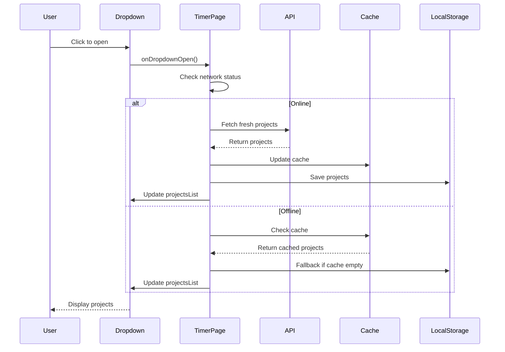
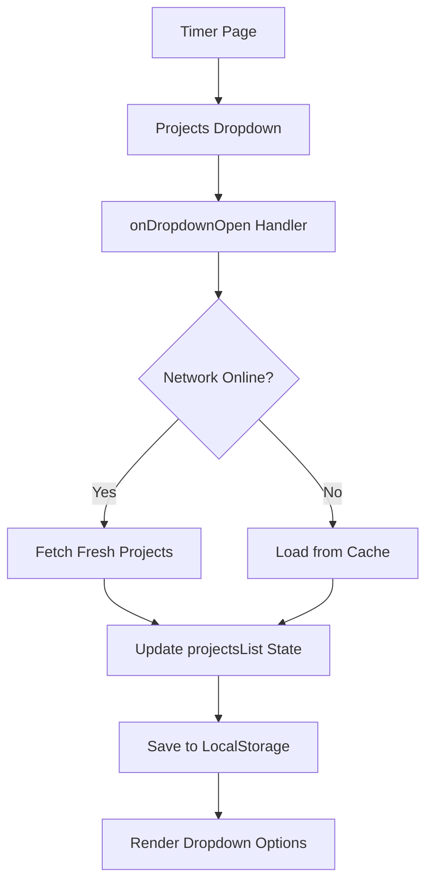

# Projects Dropdown Data Synchronization Fix

## Problem Statement

The projects dropdown in the timer page (`src/routes/timer/+page.svelte`) has a data synchronization issue where:
1. The project list remains static and fails to update even after a page refresh
2. There's no mechanism to trigger a fresh data fetch when the dropdown is opened
3. No local caching mechanism exists specifically for projects in the timer page

## Current Implementation Analysis

### Projects Loading (Lines 137-149 in timer/+page.svelte)
```javascript
if (projectsList.length === 0) {
    loadingProjects = true;
    try {
        projectsList = await projects.list();
        console.log('Projects loaded at', new Date().toISOString());
    } catch (err) {
        console.error('Error loading projects:', err);
        error = 'Failed to load projects';
    } finally {
        loadingProjects = false;
    }
}
```

### Projects API (Lines 450-460 in api.ts)
```javascript
export const projects = {
    list: async () => {
        const cacheKey = 'projects:all';
        const cached = getCached(cacheKey);
        if (cached) return cached;

        const result = await api.get('api/projects/').json<Project[]>();
        setCached(cacheKey, result, CACHE_TTL);
        return result;
    }
};
```

### Issues Identified
1. Projects are only loaded once during `onMount` - no refresh mechanism
2. The dropdown (lines 764-780) has no event handler to trigger refresh
3. Timer page has localStorage caching for active entry and today's sessions, but NOT for projects
4. The API cache exists but isn't leveraged properly for dropdown refresh

## Solution Architecture

### Overview
Implement a smart refresh mechanism that:
1. Triggers a fresh data fetch when the dropdown is opened
2. Uses local caching to persist projects for offline use
3. Respects network status (online/offline)
4. Provides visual feedback during loading

### Data Flow



### Component Architecture



## Implementation Plan

### Step 1: Add Projects Caching Constants
Add localStorage key constants for projects caching in timer/+page.svelte:
```javascript
const LAST_PROJECTS_KEY = 'timer_last_projects';
const PROJECTS_CACHE_MAX_AGE = 24 * 60 * 60 * 1000; // 24 hours
```

### Step 2: Create Projects Refresh Function
Implement a smart refresh function that:
- Checks network status before fetching
- Falls back to cache when offline
- Saves to localStorage for offline access
- Handles errors gracefully

```javascript
async function refreshProjects() {
    // Check if online
    if (!$network.isOnline) {
        console.log('Offline: loading projects from cache');
        const cachedProjects = getLocalStorageData<Project[]>(
            LAST_PROJECTS_KEY,
            PROJECTS_CACHE_MAX_AGE
        );
        if (cachedProjects) {
            projectsList = cachedProjects;
            return;
        }
        // No cache available, show error
        error = 'Cannot load projects while offline';
        return;
    }

    // Online: fetch fresh data
    loadingProjects = true;
    try {
        const freshProjects = await projects.list();
        projectsList = freshProjects;
        saveToLocalStorage(LAST_PROJECTS_KEY, freshProjects);
        console.log('Projects refreshed at', new Date().toISOString());
    } catch (err) {
        console.error('Error refreshing projects:', err);
        // Fallback to cache on error
        const cachedProjects = getLocalStorageData<Project[]>(
            LAST_PROJECTS_KEY,
            PROJECTS_CACHE_MAX_AGE
        );
        if (cachedProjects) {
            projectsList = cachedProjects;
            console.log('Using cached projects after error');
        } else {
            error = 'Failed to load projects';
        }
    } finally {
        loadingProjects = false;
    }
}
```

### Step 3: Add Dropdown Open Handler
Add an event handler to the project dropdown select element:
```javascript
function onProjectDropdownOpen() {
    console.log('Project dropdown opened, refreshing projects...');
    refreshProjects();
}
```

### Step 4: Update Dropdown HTML
Modify the project dropdown select element to include the open handler:
```html
<select
    id="project"
    bind:value={selectedProject}
    class="select select-bordered"
    required
    onfocus={onProjectDropdownOpen}
>
    <option value={null}>Select a project</option>
    {#each projectsList as project}
        <option value={project.id}>{project.title}</option>
    {/each}
</select>
```

### Step 5: Load Cached Projects on Mount
Enhance the onMount to load cached projects first:
```javascript
onMount(async () => {
    // ... existing code ...

    // Load projects (with cache fallback)
    if (projectsList.length === 0) {
        // Try cache first
        const cachedProjects = getLocalStorageData<Project[]>(
            LAST_PROJECTS_KEY,
            PROJECTS_CACHE_MAX_AGE
        );
        if (cachedProjects) {
            projectsList = cachedProjects;
            console.log('Loaded projects from cache at', new Date().toISOString());
        }

        // Then fetch fresh data if online
        await refreshProjects();
    }

    // ... rest of onMount ...
});
```

### Step 6: Update refreshAllData Function
Include projects refresh in the global refresh function:
```javascript
async function refreshAllData() {
    console.log('Auto-refreshing data at', new Date().toISOString());

    // Refresh projects
    await refreshProjects();

    // ... existing refresh logic ...
}
```

## Key Features

### 1. Smart Refresh Strategy
- **Online**: Fetch fresh data from API
- **Offline**: Use cached data from localStorage
- **Error**: Fallback to cache if API call fails

### 2. Local Caching
- Projects are saved to localStorage with timestamp
- Cache validity: 24 hours
- Automatic cleanup of stale cache

### 3. Network Awareness
- Respects network status from `$network.isOnline`
- No API calls when offline
- Graceful degradation

### 4. User Experience
- Loading indicator during refresh
- Error messages when appropriate
- Silent fallback to cache

## Testing Checklist

- [ ] Projects load correctly on initial page load
- [ ] Projects refresh when dropdown is opened
- [ ] Cached projects load when offline
- [ ] Fresh projects load when coming back online
- [ ] Error handling works when API fails
- [ ] Loading indicator displays during refresh
- [ ] Cache expires after 24 hours
- [ ] Page refresh doesn't lose cached projects

## Files to Modify

1. **src/routes/timer/+page.svelte**
   - Add projects caching constants
   - Create `refreshProjects()` function
   - Create `onProjectDropdownOpen()` handler
   - Update dropdown HTML with `onfocus` handler
   - Enhance `onMount` to load cached projects
   - Update `refreshAllData()` to include projects refresh

## Dependencies

No new dependencies required. Uses existing:
- `projects` from `src/lib/api.ts`
- `$network` from `src/lib/network.ts`
- Existing localStorage utilities in timer page
